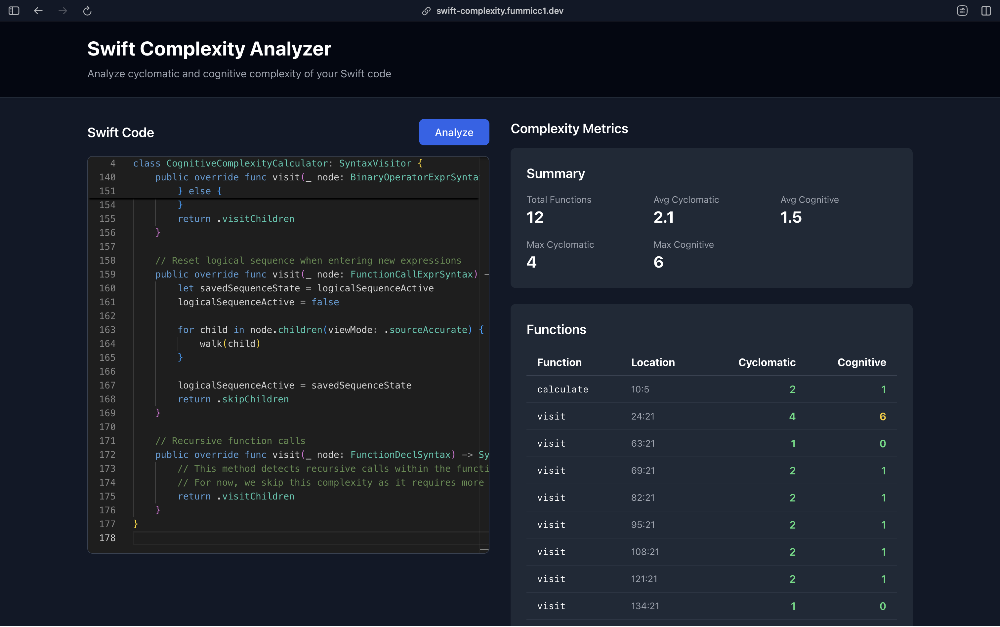
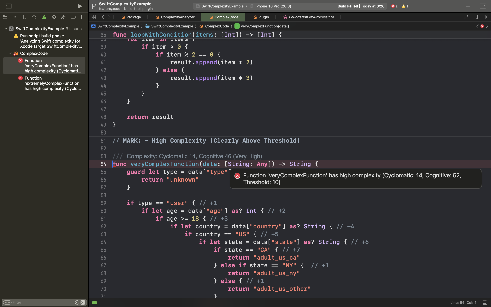

# swift-complexity

A command-line tool to analyze Swift code complexity and quality metrics using swift-syntax.

## Features

- **Multiple Complexity Metrics**: Supports cyclomatic and cognitive complexity analysis
- **Web-based Debug Interface**: Interactive browser-based complexity analyzer ([Try it online](https://swift-complexity.fummicc1.dev))
- **Xcode Integration**: Seamless integration with Xcode via Build Tool Plugin for complexity feedback during build phase
- **Xcode Diagnostics**: Display complexity warnings and errors directly in Xcode editor with accurate line numbers
- **Configurable Thresholds**: Set custom complexity thresholds via Xcode Build Settings or environment variables
- **Exit Code Integration**: Returns exit code 1 when complexity thresholds are exceeded, perfect for CI/CD pipelines
- **Multiple Output Formats**: Text, JSON, XML, and Xcode diagnostics output for different use cases
- **Flexible Analysis**: Single files, directories, or recursive directory analysis
- **Swift Syntax Based**: Uses `swift-syntax` for accurate Swift code parsing
- **Cross-Platform Support**: CLI works on macOS and Linux, library works on iOS 13+.
- **Extensible Architecture**: Designed to support additional quality metrics in the future

## Quick Start

### Web Interface (Try Online)

Visit [swift-complexity.fummicc1.dev](https://swift-complexity.fummicc1.dev) to analyze Swift code instantly in your browser.



### Installation

```bash
git clone https://github.com/fummicc1/swift-complexity
cd swift-complexity
swift build -c release
```

### Basic Usage

```bash
# Analyze a single file
swift run SwiftComplexityCLI path/to/file.swift

# Analyze a directory with threshold enforcement
swift run SwiftComplexityCLI Sources --threshold 10

# JSON output for tooling integration
swift run SwiftComplexityCLI Sources --format json --recursive

# Xcode diagnostics format (for IDE integration)
swift run SwiftComplexityCLI Sources --format xcode --threshold 15
```

## CLI Integration

The tool returns exit code 1 when any function exceeds the specified complexity threshold, making it ideal for:

- **CI/CD Pipelines**: Fail builds when complexity thresholds are exceeded
- **Git Hooks**: Prevent commits with overly complex code
- **Code Quality Gates**: Enforce complexity standards across teams

```bash
# Example: Fail if any function has complexity > 15
swift run SwiftComplexityCLI Sources --threshold 15 --recursive
# Exit code 0: All functions below threshold
# Exit code 1: One or more functions exceed threshold
```

## Supported Complexity Metrics

- **Cyclomatic Complexity**: Measures the number of linearly independent paths through code
- **Cognitive Complexity**: Measures how difficult code is for humans to understand

*Future metrics planned: LCOM, cohesion/coupling indicators*

## Documentation

- **[User Guide](docs/user-guide/)**: Installation, usage, and examples
- **[Complexity Metrics](docs/user-guide/complexity-metrics.md)**: Detailed metric explanations and examples
- **[Output Formats](docs/user-guide/output-formats.md)**: JSON, XML, and text format specifications
- **[Development Guide](docs/development/DEVELOPMENT.md)**: Setup for contributors
- **[Debug Website](debug-website/)**: Web-based interactive analyzer documentation

## Package Structure

Unified package with multiple components:

### Core Package

- **SwiftComplexityCore**: Core analysis library (supports macOS 14+, iOS 13+)
- **SwiftComplexityCLI**: Command-line interface
- **SwiftComplexityPlugin**: Xcode Build Tool Plugin

### Debug Website

- **Frontend**: Next.js application deployed on Cloudflare Workers
- **Backend**: Vapor 4 API containerized on Cloudflare Containers.
- **Live Demo**: [swift-complexity.fummicc1.dev](https://swift-complexity.fummicc1.dev)

## Usage Examples

```bash
# Analyze with verbose output
swift run SwiftComplexityCLI Sources --verbose --recursive

# Exclude test files with pattern matching  
swift run SwiftComplexityCLI Sources --recursive --exclude "*Test*.swift"

# Show only cognitive complexity above threshold
swift run SwiftComplexityCLI Sources --cognitive-only --threshold 5
```

## Xcode Build Tool Plugin

Integrates with both Swift Package Manager and Xcode projects for automatic complexity analysis during builds.

### Swift Package Manager Integration

```swift
// swift-tools-version: 6.1
import PackageDescription

let package = Package(
    name: "YourProject",
    dependencies: [
        .package(url: "https://github.com/fummicc1/swift-complexity.git", from: "1.0.0")
    ],
    targets: [
        .target(
            name: "YourTarget",
            plugins: [
                .plugin(name: "SwiftComplexityPlugin", package: "swift-complexity")
            ]
        )
    ]
)
```

### Xcode Project Integration

1. Add swift-complexity package to your Xcode project
2. In Build Phases, add "SwiftComplexityPlugin" to Run Build Tool Plug-ins
3. Configure threshold in Build Settings (optional)

### Configuration

**Xcode Build Settings:**

- Key: `SWIFT_COMPLEXITY_THRESHOLD`
- Value: `15` (or any number, defaults to 10)

**Environment Variable (SPM):**

- `SWIFT_COMPLEXITY_THRESHOLD=15`

### Features

- **Real-time feedback**: Complexity warnings appear directly in Xcode editor
- **Accurate positioning**: Errors show at exact function locations
- **Build integration**: Builds fail when thresholds are exceeded
- **Configurable per target**: Different thresholds for different modules



## Output Examples

### CLI Text Output

```text
File: Sources/ComplexityAnalyzer.swift
+------------------+----------+----------+
| Function/Method  | Cyclo.   | Cogn.    |
+------------------+----------+----------+
| analyzeFunction  |    3     |    2     |
| calculateTotal   |    5     |    7     |
+------------------+----------+----------+

Total: 2 functions, Average Cyclomatic: 4.0, Average Cognitive: 4.5
```

### Xcode Diagnostics Output

```text
/path/to/Sources/MyFile.swift:45:1: error: Function 'complexFunction' has high complexity (Cyclomatic: 15, Cognitive: 23, Threshold: 10)
/path/to/Sources/MyFile.swift:89:1: warning: Function 'anotherFunction' has high complexity (Cyclomatic: 12, Cognitive: 18, Threshold: 10)
```

## Requirements

### CLI Tool

- Swift 6.1+
- macOS 14+ or Linux

### Core Library

- Swift 6.1+
- macOS 14+, iOS 13+, or Linux

## License

MIT License
