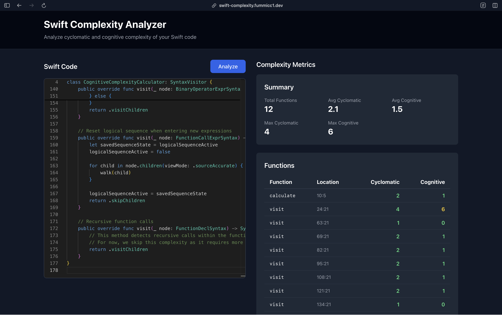
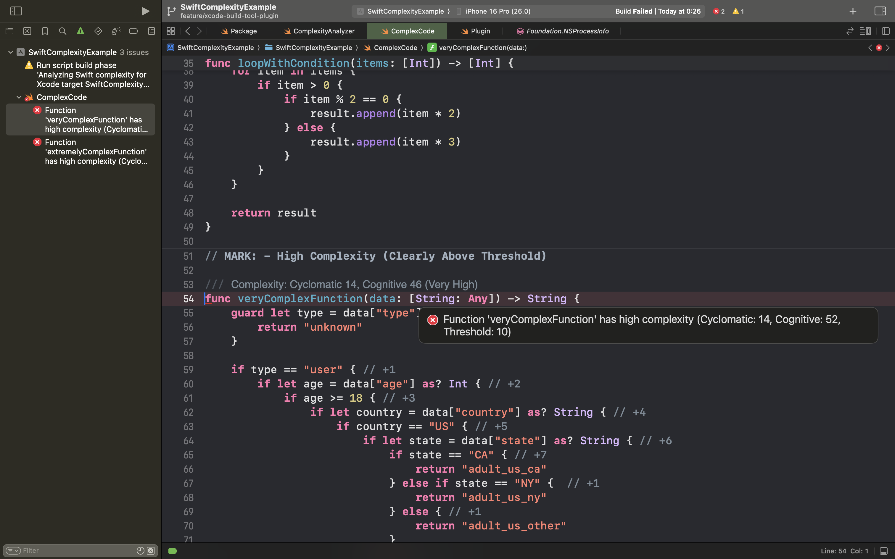

# swift-complexity

A command-line tool to analyze Swift code complexity and quality metrics using swift-syntax.

## Features

- **Multiple Complexity Metrics**: Supports cyclomatic complexity, cognitive complexity, LCOM4 cohesion, and type coupling analysis
- **LCOM4 Class Cohesion**: High-precision class cohesion measurement using IndexStore-DB semantic analysis
- **Type Coupling Metrics**: Semantic fan-in / fan-out / instability per type, plus a hotspot ranking that orders complexity violations by their blast radius ([details](docs/user-guide/coupling-metrics.md))
- **Web-based Debug Interface**: Interactive browser-based analyzer for the syntax-only metrics — cyclomatic, cognitive, and inline suppression ([Try it online](https://swift-complexity.fummicc1.dev)); index-backed metrics stay CLI-only
- **Xcode Integration**: Seamless integration with Xcode via Build Tool Plugin for complexity feedback during build phase
- **Xcode Diagnostics**: Display complexity warnings and errors directly in Xcode editor with accurate line numbers
- **Configurable Thresholds**: Set custom complexity thresholds via Xcode Build Settings or environment variables
- **Per-Type Thresholds**: Assign different thresholds to types by name (prefix/suffix) via a `.swift-complexity.yml` config — e.g. stricter limits for `*Repository`, looser for `*UseCase`
- **Inline Suppression**: Exempt a specific function or type from threshold checks with a `// swift-complexity:disable` comment, optionally scoped to `cyclomatic`, `cognitive`, `lcom4`, or `coupling`
- **Exit Code Integration**: Returns exit code 1 when complexity thresholds are exceeded, perfect for CI/CD pipelines
- **Multiple Output Formats**: Text, JSON, XML, Xcode diagnostics, and SARIF output for different use cases
- **Flexible Analysis**: Single files, directories, or recursive directory analysis
- **Swift Syntax Based**: Uses `swift-syntax` for accurate Swift code parsing
- **Cross-Platform Support**: CLI works on macOS and Linux, library works on iOS 13+. Index-backed metrics (LCOM4, coupling) live behind the opt-in `IndexStore` SwiftPM trait, so the package itself builds wherever swift-syntax does; release binaries ship with the trait enabled.
- **MCP Server**: Expose complexity analysis as tools for LLM agents (Claude Code, etc.) via Model Context Protocol
- **Claude Plugin**: Ready-to-use Claude Code plugin with MCP server and analysis skill
- **Extensible Architecture**: Designed to support additional quality metrics in the future

## Quick Start

### Web Interface (Try Online)

Visit [swift-complexity.fummicc1.dev](https://swift-complexity.fummicc1.dev) to analyze Swift code instantly in your browser.

The web interface is a debugging aid for the syntax-based metrics (cyclomatic and cognitive complexity, inline suppression). LCOM4 and type coupling need the index store of a compiled project, so they are available only in the CLI — see [Debug Website](#debug-website) for the full scope.



### Installation

On macOS the recommended path is [Homebrew](https://brew.sh):

```bash
brew install fummicc1/tap/swift-complexity
```

Or build from source:

```bash
git clone https://github.com/fummicc1/swift-complexity
cd swift-complexity
swift build -c release
```

Pre-built binaries are also available from [GitHub Releases](https://github.com/fummicc1/swift-complexity/releases) as Swift Artifact Bundles, or via `nest install fummicc1/swift-complexity`.

### Basic Usage

```bash
# Analyze a single file
swift run SwiftComplexityCLI path/to/file.swift

# Analyze a directory with threshold enforcement
swift run SwiftComplexityCLI Sources --threshold 10

# JSON output for tooling integration
swift run SwiftComplexityCLI Sources --format json --recursive

# Xcode diagnostics format (for IDE integration)
swift run SwiftComplexityCLI Sources --format xcode --threshold 15

# SARIF format (for GitHub Code Scanning)
swift run SwiftComplexityCLI Sources --format sarif --threshold 10 --recursive > swift-complexity.sarif

# LCOM4 class cohesion analysis (requires swift build first)
swift build  # Generate index
swift run SwiftComplexityCLI Sources --lcom4 --index-store-path .build/debug/index/store

# Type coupling analysis: fan-in / fan-out / instability (requires swift build first)
swift run SwiftComplexityCLI Sources --coupling --index-store-path .build/debug/index/store --recursive
```

## CLI Integration

The tool returns exit code 1 when any function exceeds the specified complexity threshold, making it ideal for:

- **CI/CD Pipelines**: Fail builds when complexity thresholds are exceeded
- **Git Hooks**: Prevent commits with overly complex code
- **Code Quality Gates**: Enforce complexity standards across teams

```bash
# Example: Fail if any function has complexity > 15
swift run SwiftComplexityCLI Sources --threshold 15 --recursive
# Exit code 0: All functions below threshold
# Exit code 1: One or more functions exceed threshold
```

### GitHub Action

Add a complexity gate with inline PR annotations in one step (requires
`v1.2.0` or later):

```yaml
permissions:
  contents: read
  security-events: write

steps:
  - uses: actions/checkout@v5

  - name: Analyze complexity
    id: analysis
    uses: fummicc1/swift-complexity@v1
    with:
      paths: Sources
      threshold: "10"

  - uses: github/codeql-action/upload-sarif@v3
    if: always()
    with:
      sarif_file: ${{ steps.analysis.outputs.report-file }}
```

See the [CI Integration guide](docs/user-guide/ci-integration.md) for all
inputs, report-only setups, and a plain-CLI alternative.

### Per-Type Thresholds

Assign different thresholds per nominal type (class/struct/enum/actor and extensions)
so each layer or feature gets its own complexity budget. Create a
`.swift-complexity.yml` (auto-discovered in the current directory, or pass `--config <path>`):

```yaml
# .swift-complexity.yml
defaultThreshold: 10            # Fallback for types matching no rule (optional)
rules:
  - prefix: Toilet              # Feature grouping (type name prefix)
    threshold: 12
  - suffix: Repository          # Layer grouping (type name suffix)
    threshold: 5
  - suffix: UseCase
    threshold: 15
```

A function's threshold is resolved from its enclosing type name: among all matching
rules the **strictest (lowest)** wins (e.g. `ToiletRepository` matches `Toilet`=12 and
`Repository`=5 → **5**). Unmatched types fall back to `--threshold` or `defaultThreshold`.

```bash
# Auto-discovers .swift-complexity.yml
swift run SwiftComplexityCLI Sources --recursive

# Explicit config path
swift run SwiftComplexityCLI Sources --recursive --config config/complexity.yml
```

### Inline Suppression

Exempt a single, reviewed function or type from threshold checks with a comment
directly above its declaration. There is no "next line" form and no "enable"
comment — the directive always applies to exactly the one declaration it
precedes, so a suppressed type never cascades to its member functions.

```swift
// swift-complexity:disable
func parseLegacyFormat(_ input: String) -> Document { ... }

// swift-complexity:disable cognitive
func stateMachine(_ event: Event) { ... }  // cyclomatic is still checked

// swift-complexity:disable lcom4
class LegacyOrderManager { ... }  // member functions are still checked
```

Suppressed values are still computed and shown in every output format — only the
threshold judgment is skipped. Run with `--report-suppressions` to print every
suppressed function and type with its current values to stderr, so suppressions
stay visible instead of silently hiding violations. See the
[usage guide](docs/user-guide/usage.md#suppressing-specific-violations) for the
full syntax, including why an unrecognized metric name suppresses nothing
rather than everything.

See the [Usage Guide](docs/user-guide/usage.md#per-type-complexity-thresholds) for full resolution rules.

## Supported Complexity Metrics

### Function-level Metrics

- **Cyclomatic Complexity**: Measures the number of linearly independent paths through code
- **Cognitive Complexity**: Measures how difficult code is for humans to understand

### Class-level Metrics

- **LCOM4 (Lack of Cohesion of Methods)**: Measures class cohesion by analyzing method-property relationships
  - **Connected Components**: Counts independent groups of related methods
  - **High Precision**: Semantic analysis powered by IndexStore-DB
  - **Implicit self Detection**: Automatically detects both `self.property` and `property` accesses
  - **Requirements**: Requires `swift build` to generate index data
- **Type Coupling (fan-in / fan-out / instability)**: Measures how tangled types are with each other over the project's semantic reference graph
  - **Fan-out**: How many other project types a type depends on (fragility)
  - **Fan-in**: How many project types depend on it (blast radius)
  - **Instability**: Martin's fan-out / (fan-in + fan-out) ratio
  - **Hotspots**: Ranks complexity violations by their enclosing type's fan-in
  - **Requirements**: Requires `swift build` to generate index data ([details](docs/user-guide/coupling-metrics.md))

## Documentation

- **[User Guide](docs/user-guide/)**: Installation, usage, and examples
- **[Complexity Metrics](docs/user-guide/complexity-metrics.md)**: Detailed metric explanations and examples
- **[Output Formats](docs/user-guide/output-formats.md)**: Text, JSON, XML, Xcode diagnostics, and SARIF format specifications
- **[CI Integration](docs/user-guide/ci-integration.md)**: GitHub Action and Code Scanning setup
- **[Development Guide](docs/development/DEVELOPMENT.md)**: Setup for contributors
- **[Debug Website](debug-website/)**: Web-based interactive analyzer for the syntax-only metrics (setup, API, and scope)

## Package Structure

Unified package with multiple components:

### Core Package

- **SwiftComplexityCore**: Core analysis library (supports macOS 14+, iOS 13+). Add `traits: ["IndexStore"]` to your `.package(...)` declaration to include LCOM4 and coupling analysis
- **SwiftComplexityCLI**: Command-line interface
- **SwiftComplexityMCP**: MCP server for LLM agent integration
- **SwiftComplexityPlugin**: Xcode Build Tool Plugin

### Debug Website

- **Frontend**: Next.js application deployed on Cloudflare Workers
- **Backend**: Vapor 4 API containerized on Cloudflare Containers.
- **Live Demo**: [swift-complexity.fummicc1.dev](https://swift-complexity.fummicc1.dev)
- **Scope**: Intentionally limited to what can be computed from source text alone — cyclomatic and cognitive complexity, `// swift-complexity:disable` suppression, and every CLI output format via the API. It exists to check analysis results quickly, not to replace the CLI.
- **Not available on the web**: LCOM4 and type coupling (they read the index store that only `swift build` of a whole project produces), `.swift-complexity.yml` per-type thresholds, and the Xcode plugin / CI integrations. See [debug-website/README.md](debug-website/README.md#-scope) for details.

## Usage Examples

```bash
# Analyze with verbose output
swift run SwiftComplexityCLI Sources --verbose --recursive

# Exclude test files with pattern matching
swift run SwiftComplexityCLI Sources --recursive --exclude "*Test*.swift"

# Show only cognitive complexity above threshold
swift run SwiftComplexityCLI Sources --cognitive-only --threshold 5

# Analyze class cohesion with LCOM4
swift build  # Generate index first
swift run SwiftComplexityCLI Sources --lcom4 --index-store-path .build/debug/index/store --format json
```

## MCP Server

The MCP (Model Context Protocol) server exposes complexity analysis as tools for LLM agents like Claude Code.

### Installation

```bash
# Homebrew (macOS, recommended)
brew install fummicc1/tap/swift-complexity-mcp

# Mint: MCP server only
mint install fummicc1/swift-complexity SwiftComplexityMCP

# Mint: both CLI and MCP server at once
mint install fummicc1/swift-complexity
```

### MCP Tools

| Tool | Description |
|---|---|
| `analyze_complexity` | Analyze Swift files/directories on disk (recursive, threshold, per-type thresholds via `config_path`, LCOM4 support) |
| `analyze_code_string` | Analyze a Swift code string directly without files on disk |

### Configuration

**Claude Code (`settings.json`):**

```json
{
  "mcpServers": {
    "swift-complexity": {
      "command": "SwiftComplexityMCP"
    }
  }
}
```

**Claude Desktop (`claude_desktop_config.json`):**

```json
{
  "mcpServers": {
    "swift-complexity": {
      "command": "SwiftComplexityMCP"
    }
  }
}
```

## Claude Plugin

A ready-to-use Claude Code plugin is available in `claude-plugin/`.

**Prerequisite:** The plugin requires `SwiftComplexityMCP` binary in your PATH. Install via Mint first:

```bash
mint install fummicc1/swift-complexity SwiftComplexityMCP
```

Then load the plugin:

```bash
# Load the plugin
claude --plugin-dir ./claude-plugin

# Use the skill
/swift-complexity:analyze-complexity
```

The plugin bundles the MCP server configuration and an `analyze-complexity` skill that guides Claude through complexity analysis workflows.

## Xcode Build Tool Plugin

Integrates with both Swift Package Manager and Xcode projects for automatic complexity analysis during builds.

### Swift Package Manager Integration

```swift
// swift-tools-version: 6.2
import PackageDescription

let package = Package(
    name: "YourProject",
    dependencies: [
        // v1.4.0 — pin the release commit; a version requirement does not resolve (see below)
        .package(
            url: "https://github.com/fummicc1/swift-complexity.git",
            revision: "25f4446f7eb0cb530bebbaaecaef37418c28f8b6"
        )
    ],
    targets: [
        .target(
            name: "YourTarget",
            plugins: [
                .plugin(name: "SwiftComplexityPlugin", package: "swift-complexity")
            ]
        )
    ]
)
```

Pin the release commit rather than a version: swift-complexity depends on the
untagged `indexstore-db`, and SwiftPM rejects a version requirement (`from:` /
`exact:`) on a package with such a dependency. Each release's commit is listed on
the [Releases](https://github.com/fummicc1/swift-complexity/releases) page.

The consuming package must declare `// swift-tools-version: 6.0` or later;
SwiftPM skips the plugin's analysis command for older tools versions.

### Xcode Project Integration

1. Add swift-complexity package to your Xcode project with Dependency Rule
   **Commit** (the release commit above) or **Branch** — a version rule fails to
   resolve for the reason described above
2. In Build Phases, add "SwiftComplexityPlugin" to Run Build Tool Plug-ins
3. Configure threshold in Build Settings (optional)

### Configuration

The plugin discovers `.swift-complexity.yml` (or `.yaml`) automatically — at the
package root for SwiftPM builds, or next to `.xcodeproj` for Xcode project
builds — so plugin builds resolve per-type rules and `defaultThreshold` exactly
like CLI and CI runs. Editing the file re-triggers the analysis.

Threshold precedence:

| `SWIFT_COMPLEXITY_THRESHOLD` env | Config file | Effective behavior |
| --- | --- | --- |
| set | any | `--threshold <env>` as fallback; per-type rules still win |
| not set | present | The config alone decides |
| not set | absent | `--threshold 10` (historical default) |

See the [Xcode Build Tool Plugin guide](docs/user-guide/xcode-plugin.md) for
details and limitations (coupling/LCOM4 gates run in CI only).

### Features

- **Real-time feedback**: Complexity warnings appear directly in Xcode editor
- **Accurate positioning**: Errors show at exact function locations
- **Build integration**: Builds fail when thresholds are exceeded
- **Shared configuration**: The same `.swift-complexity.yml` drives CLI, CI, and Xcode



## Output Examples

### CLI Text Output

```text
File: Sources/ComplexityAnalyzer.swift
+------------------+----------+----------+
| Function/Method  | Cyclo.   | Cogn.    |
+------------------+----------+----------+
| analyzeFunction  |    3     |    2     |
| calculateTotal   |    5     |    7     |
+------------------+----------+----------+

Total: 2 functions, Average Cyclomatic: 4.0, Average Cognitive: 4.5

Class Cohesion (LCOM4):
+--------------------+----------+----------+----------+----------+
| Class/Struct       | LCOM4    | Methods  | Props    | Level    |
+--------------------+----------+----------+----------+----------+
| ComplexityAnalyzer |    1     |    5     |    3     | High     |
| FileProcessor      |    2     |    8     |    4     | Moderate |
+--------------------+----------+----------+----------+----------+
```

### Xcode Diagnostics Output

```text
/path/to/Sources/MyFile.swift:45:1: error: Function 'complexFunction' has high complexity (Cyclomatic: 15, Cognitive: 23, Threshold: 10)
/path/to/Sources/MyFile.swift:89:1: warning: Function 'anotherFunction' has high complexity (Cyclomatic: 12, Cognitive: 18, Threshold: 10)
```

### SARIF Output (GitHub Code Scanning)

Generate a SARIF report and upload it to GitHub Code Scanning to get complexity
violations as inline pull request annotations:

```yaml
- name: Analyze complexity
  run: swift-complexity Sources --format sarif --threshold 10 --recursive > swift-complexity.sarif

- name: Upload SARIF
  uses: github/codeql-action/upload-sarif@v3
  if: always()
  with:
    sarif_file: swift-complexity.sarif
```

Violations are reported per metric (`cyclomatic_complexity`, `cognitive_complexity`,
and `lcom4_cohesion`) with `warning` level, escalating to `error` at twice the threshold.

## Requirements

### CLI Tool

- Swift 6.2+
- macOS 14+ or Linux

### Core Library

- Swift 6.2+
- macOS 14+, iOS 13+, or Linux

### Index-Backed Metrics: LCOM4 and Coupling (Optional)

- **Building from source**: pass `--traits IndexStore` (`swift build --traits IndexStore`). The trait is off by default because its `indexstore-db` dependency does not build on every platform; without it, `--lcom4` and `--coupling` exit with a rebuild hint. Homebrew, GitHub Releases, and the GitHub Action ship binaries with the trait enabled
- **macOS 14+**: Xcode toolchain is auto-detected
- **Linux**: Requires `--toolchain-path` option pointing to Swift toolchain
- Project must be buildable with `swift build`
- Index data at `.build/debug/index/store` (generated by build)

**Linux Example:**

```bash
# Using Swiftly-installed toolchain
TOOLCHAIN=~/.local/share/swiftly/toolchains/swift-6.2.2-RELEASE
swift build --traits IndexStore \
  -Xcxx -I${TOOLCHAIN}/usr/lib/swift \
  -Xcxx -I${TOOLCHAIN}/usr/lib/swift/Block
.build/debug/SwiftComplexityCLI Sources --lcom4 \
  --index-store-path .build/debug/index/store \
  --toolchain-path ${TOOLCHAIN}
```

## License

MIT License
